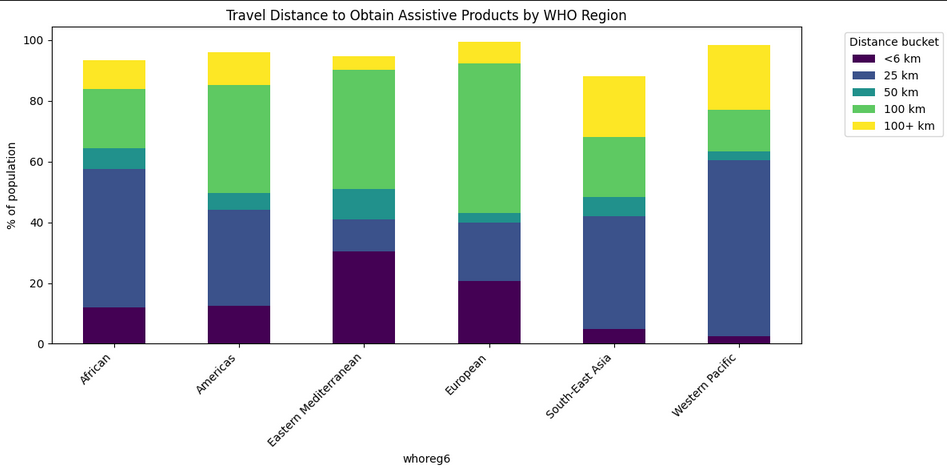

## Repository name
Your repostiory should be named something like `async-final-project-color-name`
Example: `async-final-project-teal-Anas`

## Dataset
[Health care system and access (WHO Global Health Observatory)](https://www.who.int/data/inequality-monitor/data#PageContent_C691_Col00)

I chose this dataset because it directly reflects one of the most pressing global challenges: equitable access to healthcare. The WHO Global Health Observatory provides indicators from nearly every country, disaggregated by age, sex, residence, and economic status. This makes it possible to explore health inequalities across regions, populations, and income groups.

This dataset also aligns with my personal interests in healthcare accessibility and technology for social good. By analyzing global trends in health system capacity and access, I can highlight disparities that matter for public health and connect them to real-world solutions, such as apps and tools that improve healthcare access.

## Progress
- [X] Picked dataset
- [X] Defined 10 questions
- [X] Answered 10 questions using Pandas
- [X] Added at least one data visualization (using Matplotlib and/or Seaborn) to each single question
- [x] Prepared presentation slides to present at graduation

## Questions
- [X] Question 1: How does cataract surgical coverage vary across WHO regions?
  - Answer: Cataract surgical coverage varies significantly across WHO regions. High-income regions such as Europe report the highest effective coverage (>50%), while regions such as South East Asia and America show lower levels (<40%). This disparity highlights ongoing challenges in ensuring equitable access to essential eye health services, which are a component of universal health coverage.
  - Visualization: 

- [x] Question 2: How does the density of medical doctors vary across WHO regions?
  - Answer: According to the WHO dataset, the indicator "Medical doctors (%)" appears standardized across regions with all WHO regions averaging around 50%. This suggests that the dataset dpes no represent the raw density of doctors but instead reflects a normalized index of availability
  - Visualization: 

- [x] Question 3: What is the gender distribution of nursing personnel across WHO regions?
  - Answer: The data reveals that nursing personnel are predominantly female across all WHO regions. On average, women make up more than 70% of the nursing workforce globally. The gender imbalance is most pronounced in the European and American regions, where female representation exceeds 80%. By contrast, the African and Eastern Mediterranean regions show relatively higher shares of male nurses (30–40%), though women still form the majority.
  - Visualization: 

- [x] Question 4: What proportion of households face catastrophic health expenditures (>10% of income)?
  - Answer: The data shows clear variation in the share of households experiencing catastrophic health spending. The Eastern Mediterranean region has the highest proportion, with nearly 14% of households spending more than 10% of their income on healthcare. The European region also reports relatively high levels (~12%), followed by the Americas (~10%). In contrast, the African and Western Pacific regions show the lowest proportions (~7–8%).
  - Visualization: 

- [x] Question 5: Which regions have the highest share of households pushed into poverty due to health expenditures?
  - Answer: The results show that Africa has the highest poverty impact from health expenditures, with over 30% of households pushed below international or relative poverty lines. This reflects high out-of-pocket spending and limited financial protection. South-East Asia also reports significant effects, averaging around 12–14%, while the Americas and Eastern Mediterranean fall in the mid-range (~10–15%). By contrast, the European and Western Pacific regions show the lowest proportions (<10%), consistent with stronger universal health coverage and social protection mechanisms.
  - Visualization: 

- [x] Question 6: How does the use of assistive products vary across WHO regions?
  - Answer: The use of assistive products differs significantly by WHO region. The Eastern Mediterranean and European regions report the highest rates, with around 30–35% of the population using assistive products. Usage is moderate in the South-East Asian region (~22%), but much lower in the Americas (~13%) and the African region (~5%). The Western Pacific region shows the lowest usage, with barely 1% of the population using assistive products.
  - Visualization: 

- [x] Question 7: What is the unmet need for assistive products across WHO regions?
  - Answer: Unmet need for assistive products is extremely high in most regions, with the Western Pacific and African regions nearing 100% of people lacking access, followed closely by the Americas and South-East Asia. Even the European region, which fares best, still shows around 75% unmet need, highlighting that access to essential items like glasses, hearing aids, and mobility aids remains a global challenge that disproportionately affects low- and middle-income regions.
  - Visualization: 

- [x] Question 8: How far do people need to travel to obtain assistive products across WHO regions?
  - Answer: Travel distances to obtain assistive products differ sharply across WHO regions. In the European and Eastern Mediterranean regions, a large share of people can access products within 6–25 km, while in the African and Western Pacific regions many must travel over 50 km, with some exceeding 100 km. These long travel distances create significant barriers to timely and affordable access, particularly in low- and middle-income countries.
  - Visualization: 

- [x] Question 9: How has catastrophic health spending (>10% of income) changed over time across income groups?
  - Answer: The data shows that low- and lower-middle-income countries consistently face the highest burden of catastrophic health spending, with many years exceeding 15–20% of households affected, while high- and upper-middle-income countries remain lower and more stable over time. Although there is some fluctuation, the gap between richer and poorer countries persists, underscoring deep inequities in financial protection and the challenges of achieving universal health coverage in low-income settings.
  - Visualization: 

- [x] Question 10: How does financial protection differ across income groups in the latest year?
  - Answer: In 2021, catastrophic health spending varied widely by income group, with upper-middle-income countries showing the greatest burden and variability (median around 15%, with outliers above 30%), while low- and lower-middle-income countries averaged between 2–8%. In contrast, high-income countries reported very low and stable levels (~5% or less). This pattern highlights that stronger financial protection and universal health coverage in wealthier nations reduce household exposure to medical costs, while middle-income regions remain especially vulnerable.
  - Visualization: 